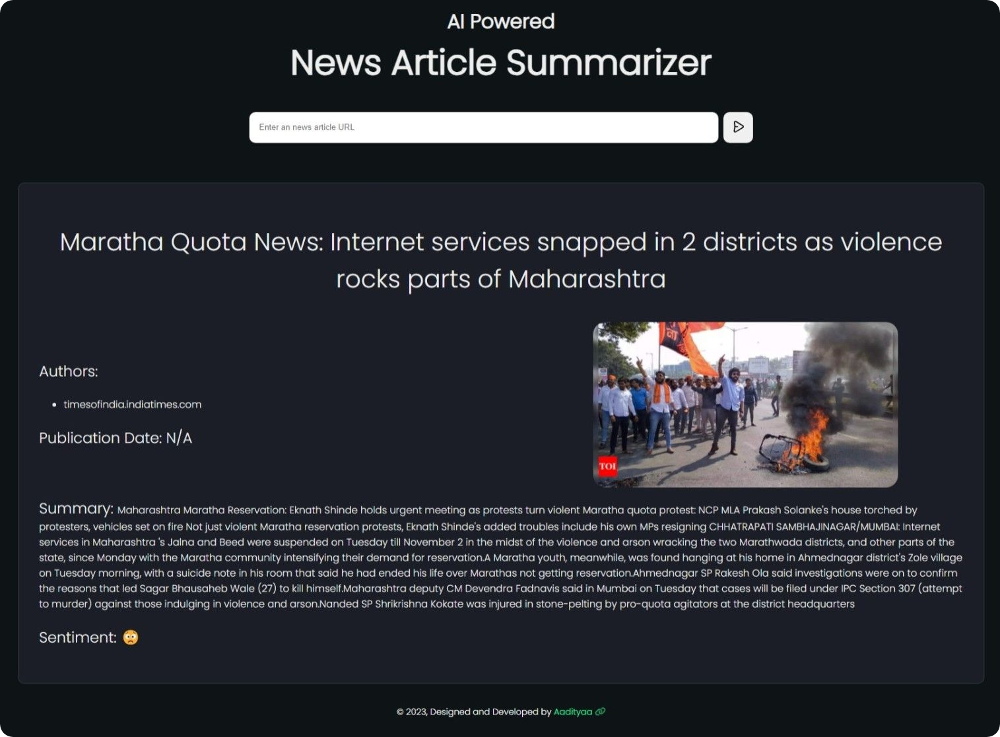

<br />
<div align="center">  
  
  <h3 align="center">AI-News-Summariser</h3>
  <p align="center">
    A tool for automatically summarizing news articles using artificial intelligence.
    <br />
    <a href="https://aisummariser.oxlac.com">Visit the Website »</a>
    <br />
    <br />
    <a href="https://www.aadinagarajan.com/#contact">Contact Developer</a>
    ·
    <a href="https://github.com/Oxlac/AI-News-Summariser/issues">Report Bug</a>
    ·
    <a href="https://github.com/Oxlac/AI-News-Summariser/issues">Request Feature</a>
    .
    <a href="https://discord.gg/x3ba4sTzgd">Discord Support</a>
  </p>
</div>

## About The Project



AI-News-Summariser is a tool designed to automatically generate concise summaries of news articles using artificial intelligence. Stay informed without spending too much time reading lengthy articles.

>[!CAUTION]
>Ensure that you use this tool responsibly. Respect the copyrights and terms of use of the news sources.

<p align="right">(<a href="#readme-top">back to top</a>)</p>

### Features
* Automatic summarization of news articles.
* Support for multiple news sources.
* Easily accessible web interface.
Export summarized content for offline reading.

### Built With
* Python
* Newspaper3k
* Flask
<p align="right">(<a href="#readme-top">back to top</a>)</p>

## Getting Started
AI-News-Summariser can be installed and used on various platforms. Follow the steps below to get started.


### Installation

1. Clone the repo
   ```sh
   git clone https://github.com/Oxlac/AI-News-Summariser.git
   ```
2. Install Requirements
   ```sh
    pip install -r requirements.txt
   ```
3. Run the app
   ```sh
    python app.py
   ```

<p align="right">(<a href="#readme-top">back to top</a>)</p>

## Future features and improvements

- [ ] Customize summarization preferences.
- [ ] Tackling corner cases where some news articles won't be parsed properly.
- [ ] Customizable summarization algorithms.
- [ ] User accounts and preferences.
- [ ] Mobile app version.
- [ ] Improvements in summarization accuracy.

See the [open issues](https://github.com/oxlac/AI-News-Summariser/issues) for a full list of proposed features and known issues.

<p align="right">(<a href="#readme-top">back to top</a>)</p>

## Contributing
Contributions are what makes the open-source community such an amazing place to learn, inspire, and create. Any contributions you make are **greatly appreciated**.

If you have a suggestion that would make this better, please fork the repo and create a pull request. You can also simply open an issue with the tag "enhancement".
Don't forget to give the project a star! Thanks again!

1. Fork the Project
2. Create your Feature Branch (`git checkout -b feature/AmazingFeature`)
3. Commit your Changes (`git commit -m 'Add some AmazingFeature'`)
4. Ensure that your code passes the ruff linter. If it does not pass view the errors and fix them.
4. Push to the Branch (`git push origin feature/AmazingFeature`)
5. Open a Pull Request

<p align="right">(<a href="#readme-top">back to top</a>)</p>

## License
Distributed under the MIT License. See LICENSE.txt for more information.

<p align="right">(<a href="#readme-top">back to top</a>)</p>

## Contact
Your Name - [@Oxlac_](https://twitter.com/Oxlac_) - contact@oxlac.com

Discord Server - [https://discord.gg/2YdnSGHdET](https://discord.gg/2YdnSGHdET)

Project Link: [https://github.com/Oxlac/AI-News-Summariser](https://github.com/oxlac/mr.dm)

Developer: [Aadityaa Nagarajan](https://aadinagarajan.com)
